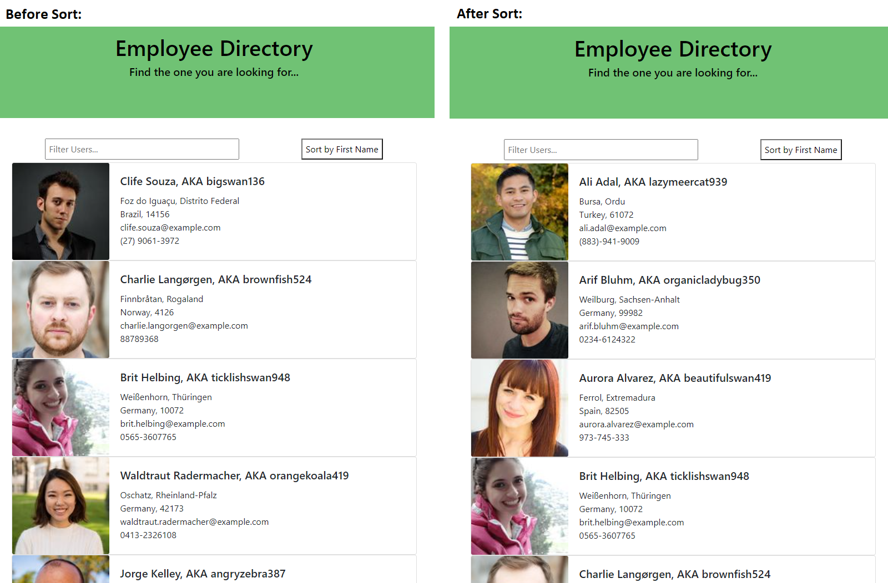

# u19-employee-directory

## Employee Directory (with randomuser API)

### Description 
This is a mock application that uses a [Random user API](https://randomuser.me/) to populate 27 random users to show basic functionallity.

You are able to FILTER by typing into the filter input to filter though users by name, location, phonenumber, email, or username.

You are able to SORT users alphabetically by first name.

### Img of Heroku Deployment

### Links

[Deployed Application](https://u19-employee-directory.herokuapp.com/)

[GitHub Repo](https://github.com/epowelldev/u19-employee-directory)